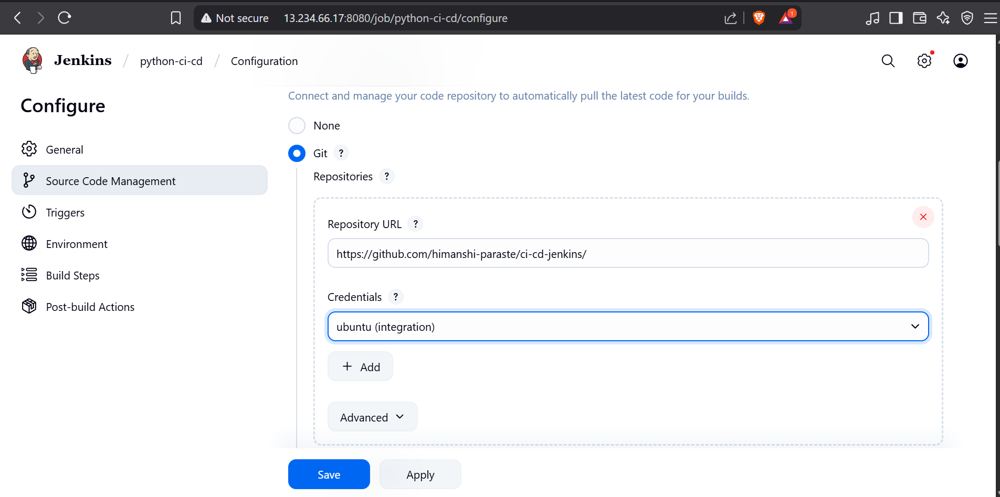

# 🚀 Python CI/CD Pipeline using Jenkins, GitHub, Docker & AWS EC2

This project demonstrates how to build a simple CI/CD pipeline that deploys a Python Flask application using Jenkins, Docker, GitHub, and AWS EC2.

---

## 📌 What You'll Do

- Create a basic Python Flask app
- Containerize it using Docker
- Push the code to GitHub
- Set up Jenkins on an AWS EC2 instance
- Build a CI/CD pipeline to automatically deploy the app when code changes

---

## 🧱 Prerequisites

- AWS EC2 instance (Ubuntu)
- Port 8080 and 5000 open in security group
- Jenkins installed and running
- Docker installed on EC2
- GitHub account and repo created
- `git`, `python3`, and `pip` installed

---

## 🔨 Step 1: Create Your Python Flask App

1. Create a file called `app.py`:

```python
from flask import Flask

app = Flask(__name__)

@app.route('/')
def home():
    a = 5
    b = 7
    result = a + b
    return f"<h1>Addition Result:</h1><p>{a} + {b} = {result}</p>"

if __name__ == '__main__':
    print("Hello from Jenkins CI/CD pipeline test!")
    app.run(host='0.0.0.0', port=5000)
```

2. Create `requirements.txt`:

```
Flask==2.2.5

```

3. Test locally (optional):

```bash
pip install -r requirements.txt
python3 app.py
```

---

## 🐳 Step 2: Dockerize the App

Create a `Dockerfile` in the same directory:

```Dockerfile
FROM python:3.10-slim

WORKDIR /app

COPY . .

RUN pip install --no-cache-dir -r requirements.txt

EXPOSE 5000

CMD ["python", "app.py"]
```

Build and run it locally (optional):

```bash
docker build -t python-app .
docker run -p 5000:5000 python-app
```

---

## 🧑‍💻 Step 3: Push Code to GitHub

1. Initialize git:

```bash
git init
git remote add origin https://github.com/<your-username>/<your-repo>.git
git add .
git commit -m "Initial commit"
git push -u origin main
```

---

## ⚙️ Step 4: Set Up Jenkins on EC2

1. Install java and Jenkins:

```bash
sudo apt update
sudo apt install fontconfig openjdk-21-jre
java -version
curl -fsSL https://pkg.jenkins.io/debian/jenkins.io.key | sudo tee /usr/share/keyrings/jenkins-keyring.asc > /dev/null
echo deb [signed-by=/usr/share/keyrings/jenkins-keyring.asc] https://pkg.jenkins.io/debian binary/ | sudo tee /etc/apt/sources.list.d/jenkins.list > /dev/null
sudo apt-get update
sudo apt-get install jenkins
```

2. Start Jenkins:

```bash
sudo systemctl enable jenkins
sudo systemctl start jenkins
sudo systemctl status jenkins

```

3. Access Jenkins on:

```
http://<EC2-IP>:8080


```
📷 

4. Install recommended plugins and create an admin user.

---

## 🔐 Step 5: Configure GitHub Credentials in Jenkins

1. Go to: `Manage Jenkins` → `Credentials` → `System` → `Global credentials`
2. Add GitHub credentials (username/password or personal access token)

---

## 📦 Step 6: Create Jenkins Freestyle Job

1. New Item → Freestyle Project → `python-ci-cd`

📷 


2. Under **Source Code Management**:
   - Git repository: `https://github.com/<your-username>/<repo-name>.git`
   - Credentials: Select the GitHub credentials

📷 

3. Under **Build Triggers**:
   - Check: `GitHub hook trigger for GITScm polling`
4. Under **Build Steps → Execute shell**:

```bash
docker rm -f python-app || true
docker build -t python-app .
docker run -d -p 5000:5000 --name python-app python-app
```

5. Apply and Save.

---

## 🔁 Step 7: Test Your CI/CD Pipeline

1. Make a small change in your `app.py` or any file.
2. Commit and push to GitHub:

```bash
git add .
git commit -m "Test Jenkins pipeline"
git push
```

3. Jenkins should auto-trigger the build, rebuild Docker image, and deploy.

---

## 🌐 Step 8: Access the Flask App in Browser

Open:

```
http://<your-ec2-ip>:5000
```

You should see:

```
Addition Result:
5 + 7 = 12
```
📷 

---


## ✅ Troubleshooting Tips

- 🔥 Port already in use? Run: sudo docker ps -a and docker rm -f <container-id>
- 🔐 GitHub SSH error? Disable SSH in Jenkins Git config and use HTTPS with credentials
- 🚫 App not loading? Check EC2 security group and Jenkins logs

---


